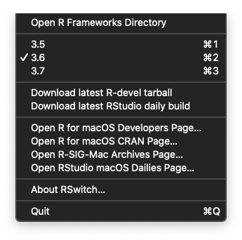

 
 
 

# RSwitch

Change 'Current' R version on macOS

## Description

At the bottom of the [R for macOS Developer's Page](http://mac.r-project.org/) there's mention of an "other binary" called "RSwitch" that is _"a small GUI that allows you to switch between R versions quickly (if you have multiple versions of R framework installed)."_ Said switching requires you to use the "tar.gz" versions of R from the R for macOS Developer's Page since the official CRAN binary installers clean up after themselves quite nicely to prevent potentially wacky behavior.

All this GUI does is change the `Current` alias target in `/Library/Frameworks/R.framework/Versions` to the appropriate version. You can do that from the command line but the switcher GUI was created so that means some folks prefer click-switching.

After launching the app, there will be a new menu item in the main macOS menubar with a popup that will look something like this:

The checkmarked version is the default (i.e. the one `Current` points to) and if you select any other version the alias will be changed. You can also launch a new Finder window that opens to the R frameworks directory or quit the app.

There are also links to various useful R macOS resources plus two menu items that will download the latest RStudio macOS daily or the latest macOS r-devel tarball. Neither shows a progress dialog but will download the respective files to `~/Downloads` and both open the Finder to that directory as well as display an alert with any succes or failure. NOTE: that you will need to delete old versions of r-devel from `~/Downloads` before re-downloading (this behavior might be changed in future releases).

## Why?

- I needed to brush up on Swift 5 coding
- I wanted RSwitch as a menubar app vs one with a dialog that I could easily lose across 15 desktops
- I wanted to see if it was possible to make it work sandboxed (TLDR: it isn't)
- The existing RSwitch source code is not available (likely got lost in the move from AT&T's domain to the new `mac.r-project.org` domain)
- The existing RSwitch binaries no longer work starting with macOS Catalina since they are 32-bit
- I'm not exactly enamored with the old-school R icons, including the RSwitch one. That's a personal preference, not a judgement or dig on the existing icons or the creators of said icons.

## What's Inside the Tin?

The `releases` directory contains ZIP files of various versions (see TODO for why there'll be future versions). Just download and extract and enjoy.

Other than that (and the example `png` & `LICENSE` file) the rest is a _super small_ Xcode project. It's commented as well to let you know what's going on.

## CAUTION

You should really build this yourself since installing random binaries from the internet (or, even official ones from things like app stores) is fraught with peril. You have no guarantee that the releases are, indeed, built from this source tree. I could be stealing all your stuff! (NOTE: I'm not). Reading and understanding the source code and building the app on your own is the only way to ensure you're not going to be compromised.

## Contributing

- Follow the [Contributor Code of Conduct](https://www.contributor-covenant.org/version/1/0/0/code-of-conduct.html)
- See the TODO (below)
- File an issue claiming an item (on any social coding site you like)
- Ensure you have [signed commits](https://git-scm.com/book/ms/v2/Git-Tools-Signing-Your-Work)
- File a PR or submit a patch via email (bob at rud dot is)

This codebase has been uploaded to the following authoritative social coding sites:

- [Gitea](https://git.rud.is/hrbrmstr/RSwitch) (self-hosted)
- [SourceHut](https://git.sr.ht/~hrbrmstr/RSwitch)
- [GitLab](https://gitlab.com/hrbrmstr/RSwitch)
- [BitBucket](https://bitbucket.com/hrbrmstr/RSwitch)
- [GitHub](https://github.com/hrbrmstr/RSwitch)

## TODO

- Clean up the icon (which is "dial" by IconMark from the Noun Project). This means having it look better in the menu bar in dark/light mode _including_ the highlight mode for it. Possibly means getting a visible "R" on it somewhere.
- Better/prettier alerting (which also means more sanity checks)
- Allow hiding of the app icon? (not sure this is a good idea, tho&hellip;pls discuss in an issue!)
- (add your own TODO suggestions via PR)
- <strike>Add Cmd-1, -2, -3, (etc) key equivalents in the menu bar for fast selection (one reason why ^^ might not be a good idea)</strike>
- <strike>Add an "about" box (mostly to ensure IconMark gets more credit than a comment and README)</strike>

## License

Copyright (c) 2019 Bob Rudis, MIT License

