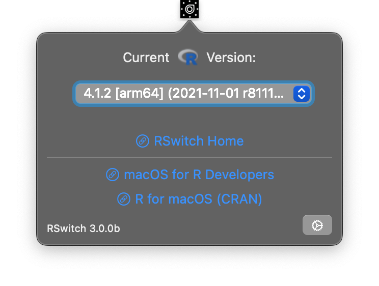

It's been Sherlocked: https://github.com/r-lib/rig/ so ima archiving the project.

---------------------------------------

# RSwitch — Menubar and command-line utility to switch R versions on macOS

The next iteration of RSwitch (macOS 11+)



## Installing the CLI tool

```bash
ln -s /Applications/RSwitch.app/Contents/SharedSupport/rswitch-cli /usr/local/bin/rswitch
````

## Using the CLI tool

```
USAGE: r-switch [<vers>] [--arch <arch>] [--silent]

ARGUMENTS:
  <vers>                  R version. e.g. 4.1

OPTIONS:
  -a, --arch <arch>       Architecture. arm64|x86_64. Defaults to system architecture.
  -s, --silent            No output after performing the switch.
  -h, --help              Show help information.
```

Example: 

```bash
$ rswitch 4.1
R version 4.1.2 (2021-11-01) -- "Bird Hippie"
Copyright (C) 2021 The R Foundation for Statistical Computing
Platform: aarch64-apple-darwin20 (64-bit)

R is free software and comes with ABSOLUTELY NO WARRANTY.
You are welcome to redistribute it under the terms of the
GNU General Public License versions 2 or 3.
For more information about these matters see
https://www.gnu.org/licenses/.
```
