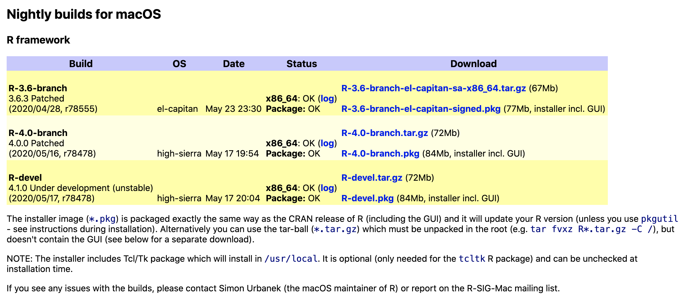
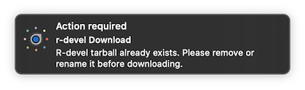
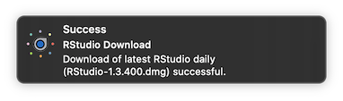

```{r include=FALSE}
knitr::opts_chunk$set(
  fig.retina = 2,
  comment = ""
)
```
RSwitch is a macOS menubar application that works on macOS 10.14+ and provides handy shortcuts for developing with R on macOS. You can download it from the [landing page](https://rud.is/rswitch/) or contribute to the [development](develop.html) of the application.

## Credits

Many thanks to the following folks for their contributions to the project to help make RSwitch better for everyone:

- [Benjamin Guiastrennec](https://github.com/guiastrennec) for suggesting improvements to the documentation regarding how to use the installer packages from the [R for macOS Developer's Page](https://mac.r-project.org/) without clobbering existing R Framework installs and also for encouraging support for RStudio Sever file uploads and exports.
- [Xavier Adam](https://github.com/xvrdm) for [adding books to the RSwitch library](https://github.com/hrbrmstr/RSwitch/pull/4).
- [Patrick Schratz](https://github.com/pat-s) for encourging the development of a command-line switcher to make it easier to use in automation (and sans mouse).

## Basic/Core Usage

After downloading and running the application a new menubar item will appear and the core menu will look something like this:


The initial and primary feature of the RSwitch app was to enable switching what your system considers to be the "current" version of R. To understand how that is "computed", you should use the "R Frameworks Directory" option which opens up  `/Library/Frameworks/R.framework/Versions` in the Finder so you can browse and manipulate the contents of that directory tree on your own.

```{r}
fs::dir_tree(path = "/Library/Frameworks/R.framework/Versions", recurse = FALSE)
```

The "R Framework" is, well, *R* on your macOS system. All of the necessary supporting libraries, code, pacakges, configuration elements, etc. exist in the framework directory. Here is the top-level contents of the `3.5` version of the R Framework:

```{r}
fs::dir_tree(path = "/Library/Frameworks/R.framework/Versions/3.5", recurse = 1)
```

When you download and run the [official R macOS installer](https://cran.r-project.org/bin/macosx/) files are installed into a versioned tree and the `Current` symbolic link is updated to point to what you just installed. By making all of the installed resources depend on the `Current` symbolic link, the R Core team made it possible to switch R versions just by changing that link. For example, The `R` console application in `/usr/local/bin` is a symbolc link to:

`/usr/local/bin/R@ -> /Library/Frameworks/R.framework/Resources/bin/R`

The `Resources` directory (and everything else in `/Library/Frameworks/R.framework/` uses the `Current` symbolic link to get to the correct targets):

- `Headers@ -> Versions/Current/Headers`
- `Libraries@ -> Versions/Current/Resources/lib`
- `PrivateHeaders@ -> Versions/Current/PrivateHeaders`
- `R@ -> Versions/Current/R`
- `Resources@ -> Versions/Current/Resources`
- `Versions/`

For the most control, you can install a coexisting version of R **oldrel**-1, **oldrel** (as of the date this document was created those would be R 3.5 and R 3.6), current **release** (R 4.0) and **devel** (4.1) by hand by going to [R for macOS](https://mac.r-project.org/) and downloading the `tar.gz` version of those distributions:



Here are direct `https` links to the tarballs:

- [R 3.6](https://mac.r-project.org/el-capitan/R-3.6-branch/R-3.6-branch-el-capitan-sa-x86_64.tar.gz) (oldrel)
- [R 4.0](https://mac.r-project.org/high-sierra/R-4.0-branch/x86_64/R-4.0-branch.tar.gz) (current)
- [R 4.1](https://mac.r-project.org/high-sierra/R-devel/x86_64/R-devel.tar.gz) (devel)

Once downloaded, you can fire up a terminal prompt, head to the root directory (i.e. `cd /`) and run `tar -xvzf path-to-thing-you-just-downloaded` to lay out the contents of the tarball onto the filesystem. You can also use the `.pkg` versions if you prefer a clicky-installer wizard, but these installers will remove any previous versions of the framework (kinda defeating the purpose). You can still use the `.pkg` format by heading over to the command line and using `pkgutil --forget` to prevent said clobbering behavior (as noted in [Section 4.2](https://cran.rstudio.org/doc/manuals/R-admin.html#Uninstalling-under-macOS) of _R Installation and Administration_. For example:

```{bash eval=FALSE}
sudo pkgutil --forget org.r-project.R.el-capitan.fw.pkg \ # may need to use high-sierra vs el-capitan
             --forget org.r-project.x86_64.tcltk.x11 \
             --forget org.r-project.x86_64.texinfo \
             --forget org.r-project.R.el-capitan.GUI.pkg
```

Once you install one of these versions, `Current` gets manipulated to point to it. You can either `rm` the existing symbolic link and `ln -s` a new one or _just use RSwitch_!

Upon initial click, RSwitch figures out which versions of R you have installed and lets you switch them just by selecting the versioned menu item. When the change is made you get a handy notification letting you know the action performed successfully and which R version you changed to:


<div class="alert alert-warning" role="alert" style="color:black"><span class="glyphicon glyphicon-bell" aria-hidden="true"></span> NOTE that it is not a good idea to switch what your Mac thinks is the current version of R while active R sessions exist unless you really know what you're doing as you may lose work.</div>

## Keeping Toolsets Current

The main goal of the package was to make it easier to switch the current version of R to something else. If you have that need, chances are that you are playing with the development version of R and said version has nightly builds. 

Similarly, if you are living on the cutting edge of R you are also likely doing the same with [RStudio dailies](https://dailies.rstudio.com/rstudio/oss/mac/).

RSwitch provides two handy menu item shortcuts to download either of those resources, but it expects you do _some_ work to use them. When you select either of the "Download latest&hellip" items some checks are performed (mostly to find the current version of the latest RStudio daily) and if it finds either the r-devel tarball or the exact same version of the RStudio disk image in the `~/Downloads` directory it will let you know you need to clean up after yourself first:




If RSwitch can download the requested resource it will do so in the background and grey out the selected item until the process is complete. When the process is complete (or errors) a notification will be sent:



and the Finder will open up to `~/Downloads` with the target file selected.

## Getting Help or Resources from the Internet

Since RSwitch is designed to help you work with R on macOS it seemed only fitting to provide some handy links to resources like the R for macOS page, the CRAN R page, RStudio dailies link, etc. They're all available via the fairly obvious sub-menu:


and each item will open up in your default web browser. (File an issue if you'd like more links added)

## Even Moar Switching

Since the theme of RSwitch is, well, _switching_ it, further, seemed only fitting to allow you to make any open RStudio or R GUI instance active from the app:


The list is presented in app order (RStudio first since it's super likely that's what most macOS R folk are using) and then in app launch order (oldest on top). As shown, if RSwitch can detect what the open RStudio project or package is, that name gets added to the switching title.

## The Item That Launched A Thousand Instances

While being able to switch to running instances is fine, it would also be handy to be able to launch RStudio or R GUI from the menubar app. If none are currently running you can launch them with the obviously named menu items. If you hold down `<Control>` as you click on the RSwitch icon you'll be given the opportunity to launch new, concurrent instances of either application.

## Speaking of Current

RSwitch is under active, heavy development. Even when the development cycle dies down it will receive updates as bugs are fixed and new features are added. Rather than make you subscribe to a blog or monitor Twitter or social coding sites RSwitch now lets you check for updates right within the app. If there are no updates you get a notification telling you so:


otherwise, a link will open in your default browser so you can download the latest version.

## Beyond The Desktop

Starting with version 1.5.0, RSwitch is now your control center for organizing and accessing RStudio Server instances:


Creating a new connection is just a simple form:


and you can then launch a task-specific browser for each instance you have defined:


This allows you to keep RStudio Server work separate from your internet browsing, creating a more focused workspace that you never have to worry about accidentally closing. Window size & position are preserved across launches, too and the keystrokes you are used to in RStudio Desktop on macOS are the same in this task-specific browser.

File uploads and downloads ("exports") are also now supported.

## Have It Your Way

There's a minimal preferences system for showing/hiding the dock icon and for enabling background checks for and notifications when new RStudio Dailies are available.


Another (new) preference is "Ensure RStudio opens R/Rmd files". Xcode and other developer-oriented programs seem to love to takeover either `.R` and `.Rmd` (sometimes both) and loading Xcode can take a while. Setting this preference will enable an hourly check for who owns those extensions and forces them back to RStudio in the event they are changed.

## Always On

If you like RSwitch enough to keep it running all the time, just drag the item to the "Login Items" table of your user in the "Users & Groups" pane of "System Preferences"


## Taking Command(line)

There's a new command-line switcher for folks who would rather not interact with a menu to change R versions. `RSwitch.app` comes with `rswitch-cmd` tucked into `/Applications/RSwitch.app/Contents/Resources/`. You can make it easier to type by making a symbolic link in `/usr/local/bin/` (or your preferred path that's on `$PATH`):

```shell
$ ln -s /Applications/RSwitch.app/Contents/Resources/rswitch-cmd /usr/local/bin/rswitch
```

Firing off just `rswitch` will bring up a list of available R installs with an asterisk signifying which one is active:

```shell
$ rswitch
2.14 (incomplete)
3.5
3.6
3.7
4.0 *
4.1
```

Just call it with the version you want to switch to and you are ready to go (you can also use `--list` or `-l` if you like typing more than you need to):

```shell
$ rswitch 4.1
$ rswitch --list
2.14 (incomplete)
3.5
3.6
3.7
4.0
4.1 *
```

You'll receive an error message if the version specified cannot be found:

```shell
$ rswitch 4.4
R version 4.4 not found.
```

All non-successful operations will set a non-zero exit code in the event you are using the command-line utility in scripts.

## Getting Help

If you're having trouble with RSwitch or have a feature request, head on over to any of the following social coding sites and file an issue:

- [My self-hosted Gitea instance](https://git.rud.is/hrbrmstr/RSwitch)
- [SourceHut](https://git.sr.ht/~hrbrmstr/RSwitch)
- [GitLab](https://gitlab.com/hrbrmstr/RSwitch)
- [Bitbucket](https://bitbucket.com/hrbrmstr/RSwitch)
- [GitHub](https://github.com/hrbrmstr/RSwitch)


